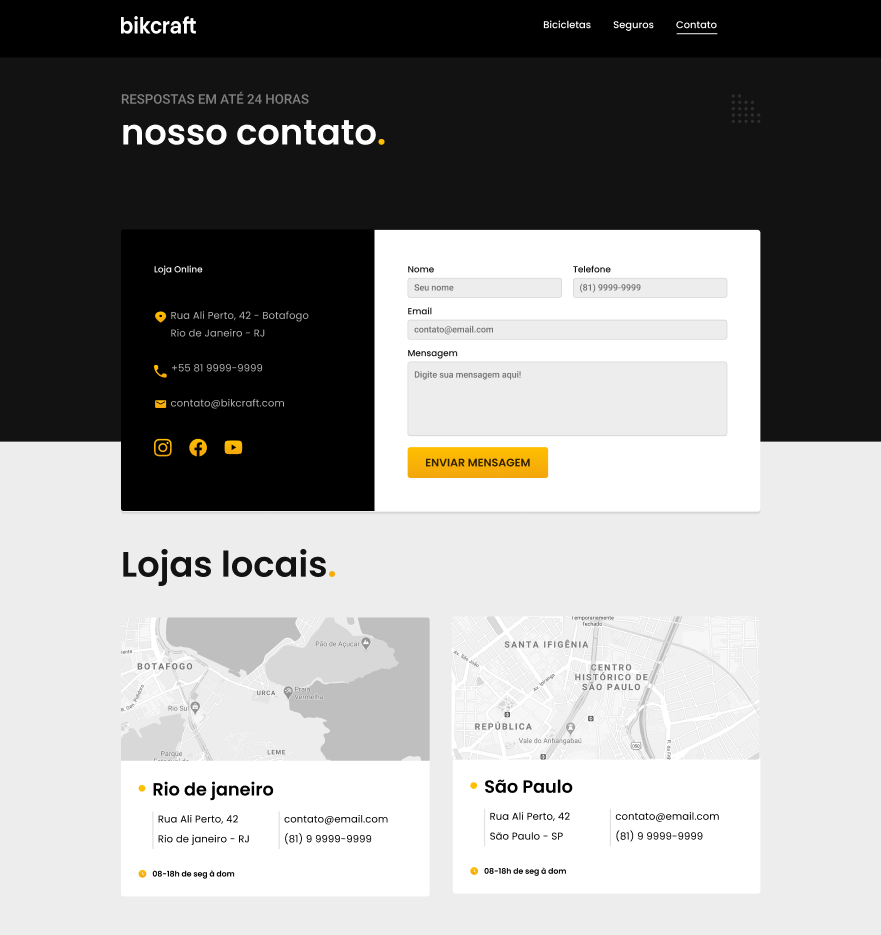

Projeto bikcraft feito desde o UX/UI design até o código. Usando apenas HTML e CSS como tecnologias.
O objetivo do site foi desenvolver minhas habilidades tanto na parte de pesquisa para UI/UX Design e 
também, ná parte do código.
Site inteiramente responsivo. 
 
Obs: <strong>as imagens foram retiradas do curso da Origamid.</strong>

Página sobre as bicicletas:

 
Página sobre os seguros:

 
Página sobre o orçamento:

 
Página sobre a Nimbus Stark:

 
Página sobre o contato:

